# Api Gateway

### O que são APIs ?

Uma API (Interface de Programação de Aplicativos) é um conjunto de regras e definições que permite
que diferentes softwares se comuniquem entre si.

Em termos simples, uma API permite que um software utilize os recursos de outro software de forma controlada e segura.

### O que é Gateway ?

O API Gateway é um padrão de projeto que atua como um intermediário entre clientes e serviços back-end.

Ele ajuda a simplificar a arquitetura de microserviços, melhorar a segurança, facilitar a manutenção e gerenciar o tráfego de rede.

Em resumo, o API Gateway funciona como uma porta de entrada para as APIs, simplificando o acesso e a gestão das mesmas.

### Algumas Funcionalidades

- **Roteamento de requisições:** direcionar as requisições dos clientes para os serviços apropriados.

- **Autenticação e autorização:** garantir que apenas usuários autorizados tenham acesso aos serviços.

- **Monitoramento e análise de tráfego:** coletar métricas e dados de uso das APIs.

- **Transformação de dados:** converter formatos de dados, como JSON para XML, por exemplo.

- **Cache de respostas:** armazenar em cache respostas para reduzir o tempo de resposta.

- **Rate limiting:** controlar a taxa de requisições para evitar sobrecarga nos serviços.

- **Logging e rastreamento:** registrar informações para facilitar a depuração e auditoria.

- **Gerenciamento de versões:** suportar múltiplas versões de APIs e controlar sua evolução.

### Vantagens e Desvantagens

**Vantagens:**

- Padronização de segurança e logging;
- Ajuda na governança de rede;
- Ponto único de entrada na rede, facilitando o gerenciamento.

**Desvantagens:**

- Adiciona complexidade na arquitetura;
- Precisa de um cuidado extra, devido a disponibilidade **(ter no mínimo 3 instâncias)**;
- É uma ferramenta que precisa de manutenção/atualização devido as vulnerabilidades.

---

## Kong API Gateway

O Kong atua como um intermediário entre clientes e serviços, fornecendo recursos como autenticação, autorização, monitoramento,
limitação de taxa, transformação de dados, entre outros.

No site: https://docs.konghq.com/hub/ podemos adicionar plugins ao nosso Kong para nos ajudar a configurar o API Gateway.

### Subindo o Kong

Caso a imagem `claudioed/kong-fc` no arquivo `kong_compose.yml` não funcione, você pode criar uma imagem e subir ela utilizando o
exemplo em `/docker/Dockerfile`.

> **O que é o Konga ?**
> 
> Interface administrativa para o Kong API Gateway;
> 
> Visualização de métricas das instâncias;
> 
> Controle de usuários.
> 
> Site: https://github.com/pantsel/konga

**Subindo o docker-compose:**

Com o seu terminal aberto na pasta `./compose`, rode o comando: `docker-compose -f kong_compose.yml up`.

Ao carregar todos os containers, acesse seu navegador: `localhost:8085`, será aberto a tela do Konga.

- Crie um login para ter acesso ao portal.

## Configurando as Services

A função **services** é utilizada para configurar e gerenciar os serviços que serão expostos através do API Gateway Kong.

Esses serviços representam as aplicações ou microserviços que serão acessados pelos clientes através da API.

**Vamos configurar o microserviço de bets do `kong_compose.yml` no Konga**

Na interface do Konga, cadastre um novo serviço:
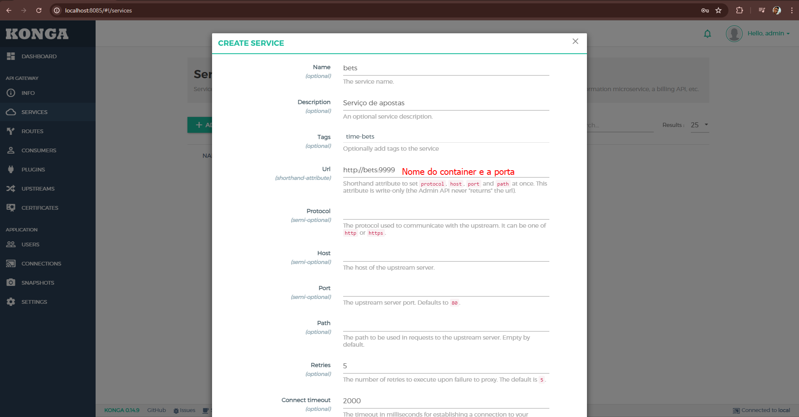

## Configurando as Rotas

É o "caminho" de url que permitirá que um serviço seja acessado pelo Kong API Gateway.

**Vamos configurar a rota no Konga**

Na interface do Konga, clique no serviço que foi criado acima e clique em `Routes`:
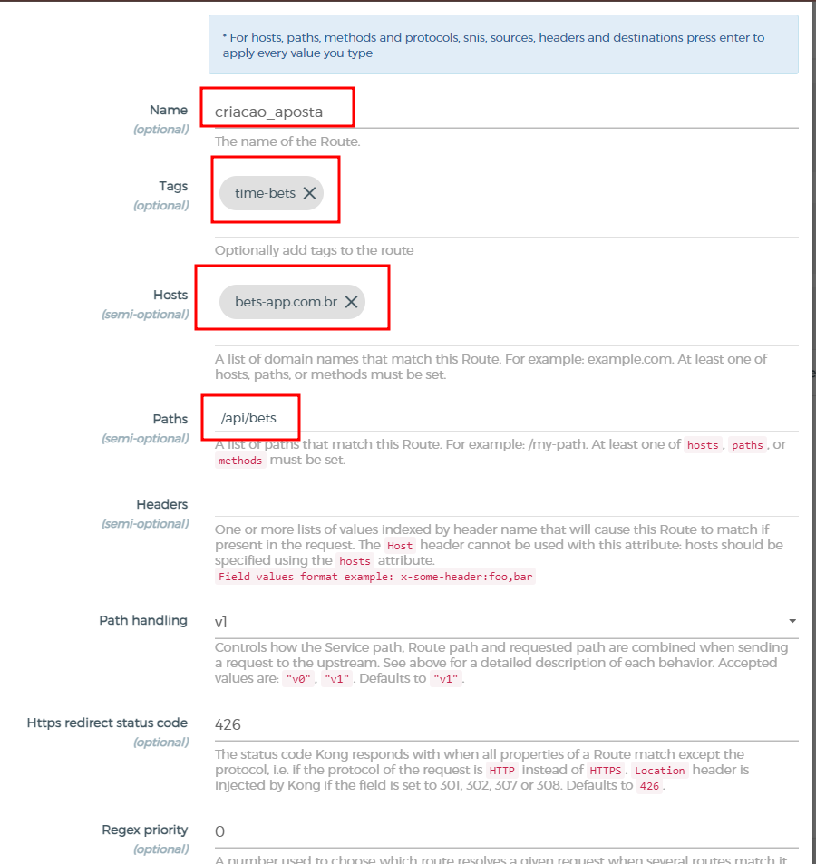
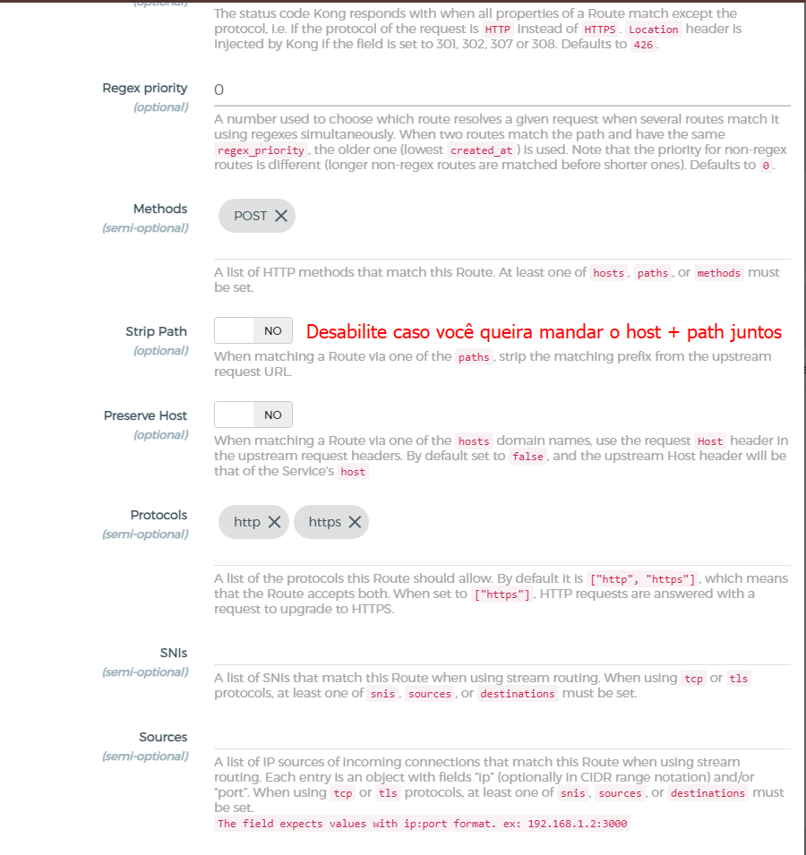

Após essas configurações, clique em `Submit Route`.

> No `kong_compose.yml`, temos o container do Kong e fazemos um forward da porta 8000 do proxy para a porta 80 da nossa máquina.
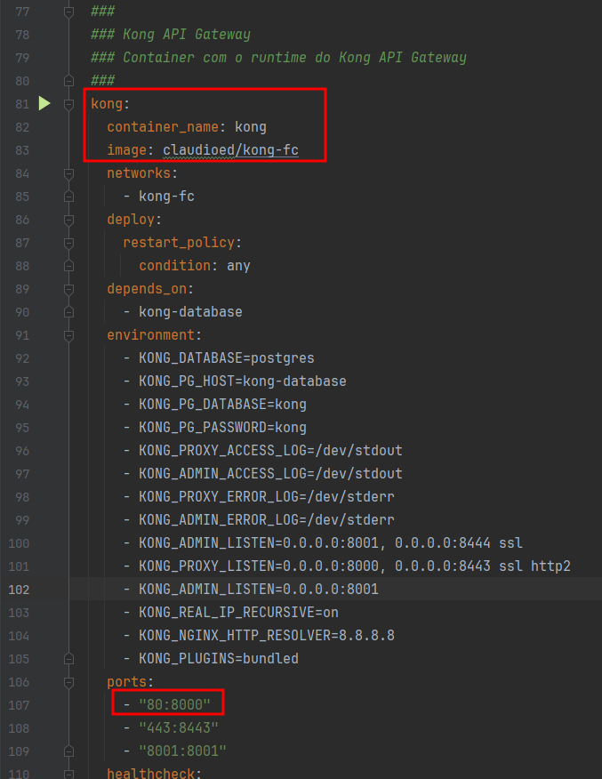

Com isso, conseguimos acessar o serviço de `bets` e criar uma aposta pelo **Postman**:

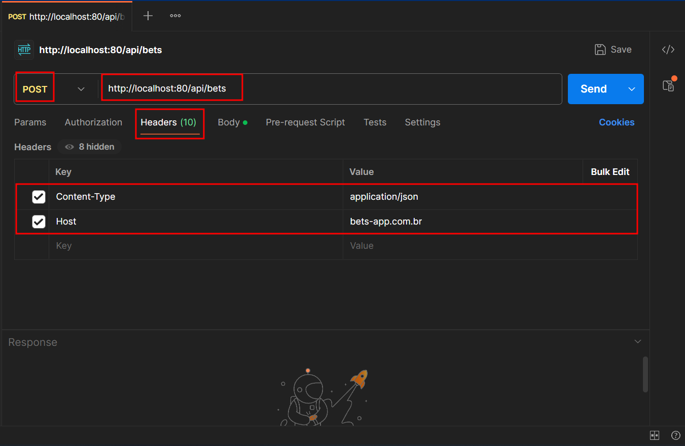

E no Body, selecione a opção `raw`, `JSON` e cole o código abaixo:

`{
"match": "1X-DC",
"email": "joe@joe.com",
"championship": "UEFA Champions League",
"awayTeamScore": "2",
"homeTeamScore": "3"
}`

>E ao enviar, você deverá receber uma mensagem semelhante a:
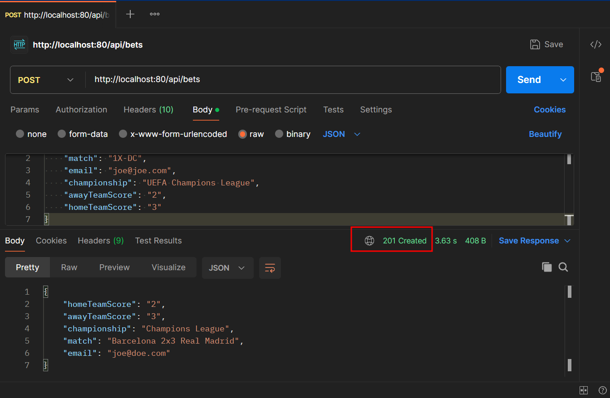

## Configurando Plugins

Os plugins no Kong são funcionalidades adicionais que podem ser adicionadas ao API Gateway para estender suas capacidades,
podem ser configurados nas Rotas, Serviços, Consumers e Globalmente.

> Alguns exemplos de plugins incluem autenticação, autorização, transformação de dados, rate limiting, logging, entre outros.

E você pode escreve-los usando a linguagem **lua, javascript e golang** ou utilizar os que já existem na comunidade.

### Configurando o plugin `Correlation ID`

Para isso, vamos utilizar o plugin `Correlation ID`, que gera um ID único para cada solicitação e o inclui nos cabeçalhos
das requisições: https://docs.konghq.com/hub/kong-inc/correlation-id/

- Na interface do Konga, vamos abrir a aba de `Plugins`:
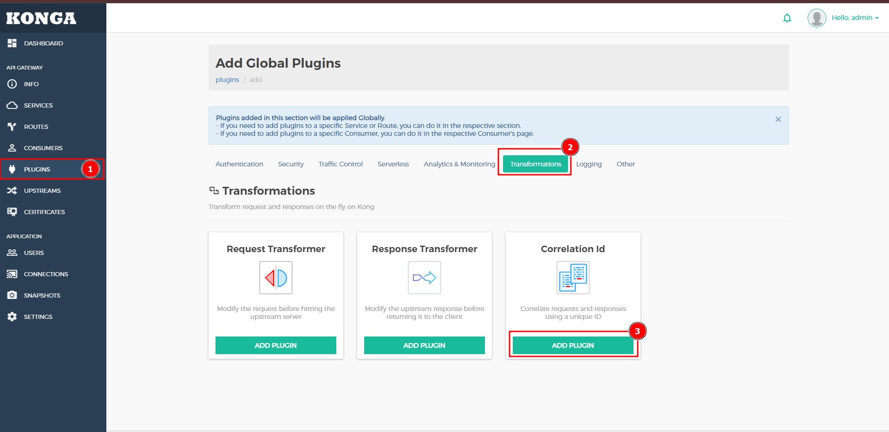

- Configure e adicione o `Correlation ID`:
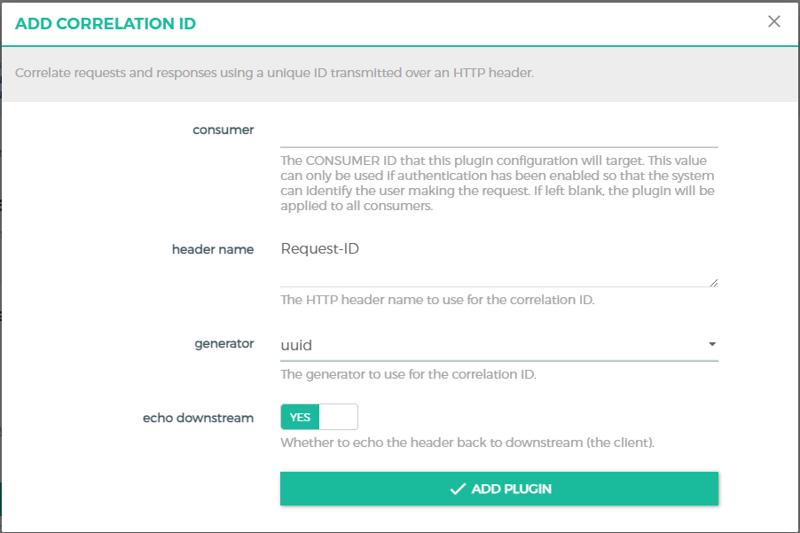

E ao enviar uma nova request pelo `postman`, podemos ver que foi adicionado um **novo parametro** no Header da response:
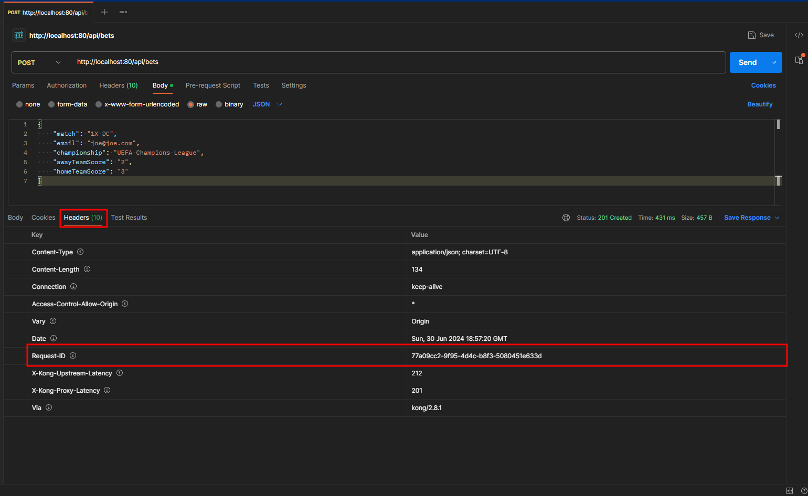

### Configurando o plugin `Rate Limiting`

Para isso, vamos utilizar o plugin `Rate Limiting`, que permite controlar a taxa de requisições que um determinado IP
pode fazer a uma API em um determinado período de tempo: https://docs.konghq.com/hub/kong-inc/rate-limiting/

Na interface do Konga, vamos adicionar esse plugin no serviço de `bets`:
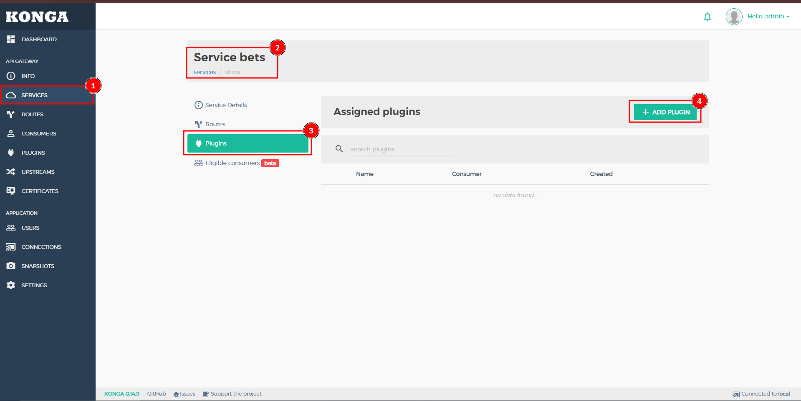

Ao clicar em `+ ADD PLUGIN`:
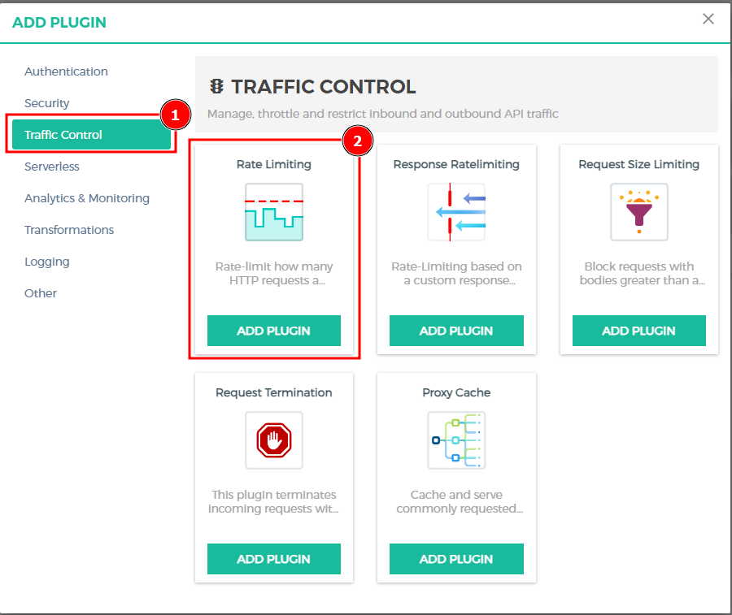

E configure com as informações abaixo:

| Campo               | Valor | Descrição                                                                                                                                  |
|---------------------|-------|--------------------------------------------------------------------------------------------------------------------------------------------|
| minute              | 5     | Máximo de requisições por minuto                                                                                                           |
| limit by            | ip    | Limita as requisições com base no ip do Cliente                                                                                            |
| policy              | local | Local: Permite o máximo de requisições por minuto em cada instância. Cluster: Permite o máximo de requisições independente das instâncias. |
| fault tolerant      | yes   | Caso a contagem do rate limiting falhar ele permitirá a requisição                                                                         |
| hide client headers | yes   | Esconde a informação de quantas requisições faltam para limitar                                                                            |

Com o plugin aplicado, ao fazermos mais de **5 requests** para a api `bets`, receberemos uma mensagem de erro:
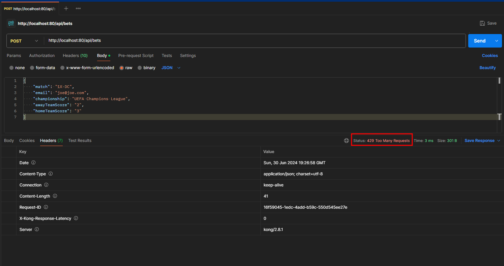

### Configurando o plugin `Response Transformer`

É uma funcionalidade que permite modificar a resposta de uma API antes de ser enviada de volta ao cliente.

Com ele, é possível realizar transformações nos dados, como adicionar ou remover campos, alterar formatos, entre outras customizações.

Na interface do Konga, vamos adicionar esse plugin no serviço de `bets`:

Ao clicar em `+ ADD PLUGIN`:
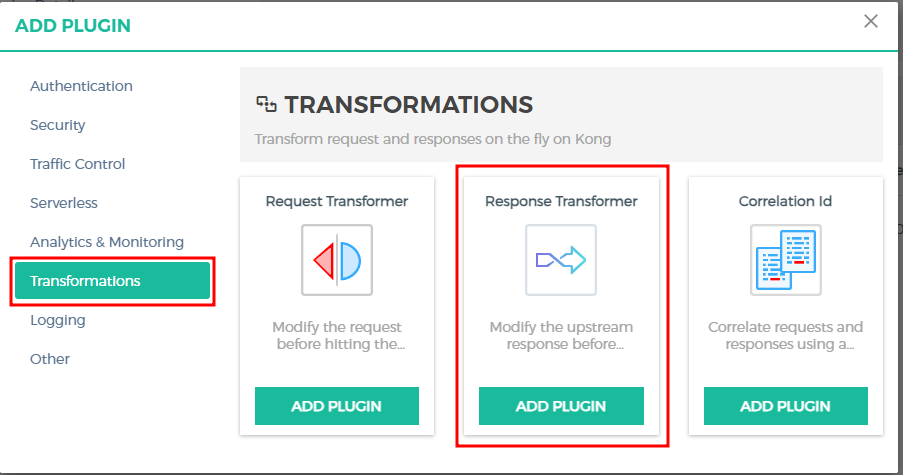

E para exemplo, vamos configurar como na imagem abaixo:
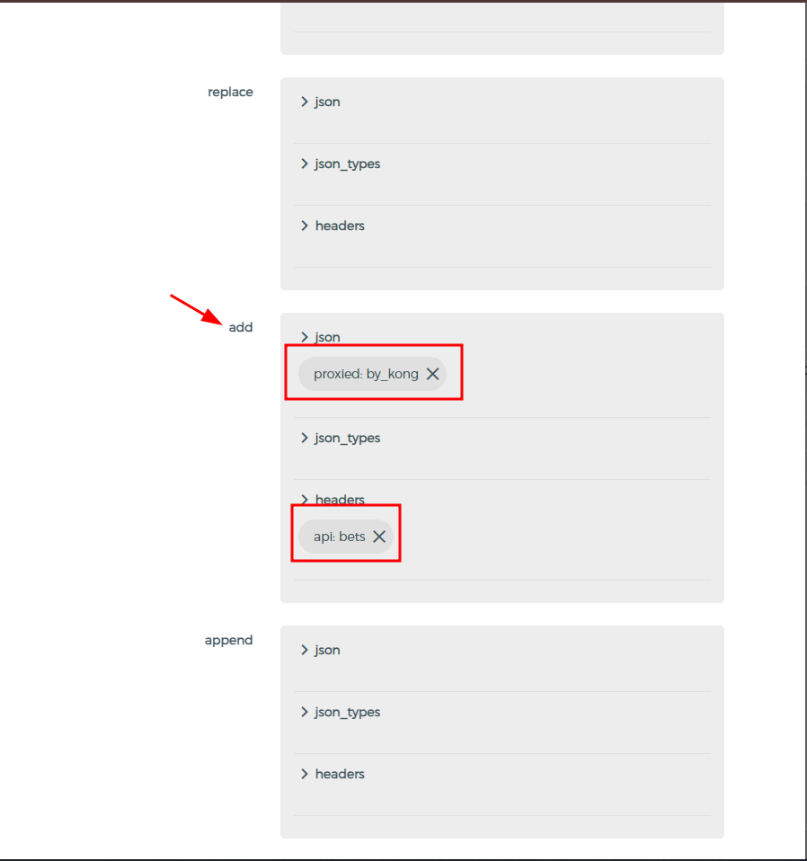

Agora ao chamar a requisição, o body da resposta terá o campo `proxied`:
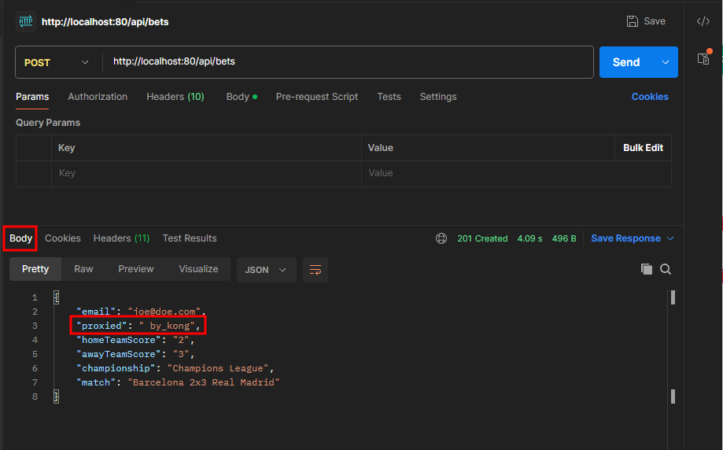

E nos Headers, terá o header `api`:
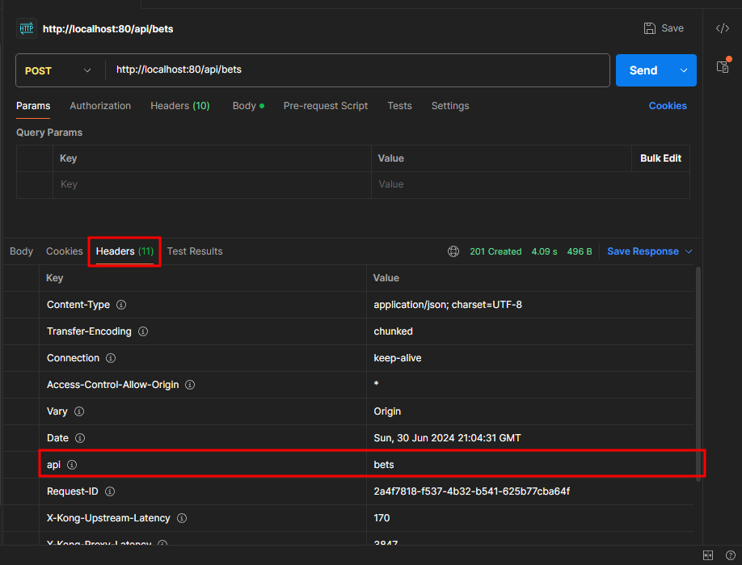

## O que são Consumers

Representa um consumidor de APIs. Ele pode ser um **usuário final**, um **aplicativo** ou qualquer entidade que faça
solicitações para consumir os serviços disponibilizados por uma API.

Os **Consumers no Kong** são usados para controlar o **acesso**, **autenticação** e **autorização** dos consumidores às APIs
gerenciadas pelo Kong API Gateway.

### Configurando consumers

**Criando consumer de usuário final:**

Na aba de **Consumers**, clique em `+CREATE CONSUMER`
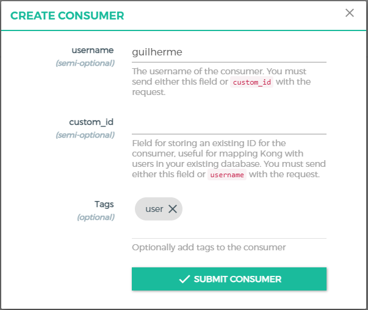

> Faça a mesma coisa para criar o consumer do app, com o username = `app-apostas` e tag = `app`.

**Vamos criar um Basic Auth para nosso usuário final:**
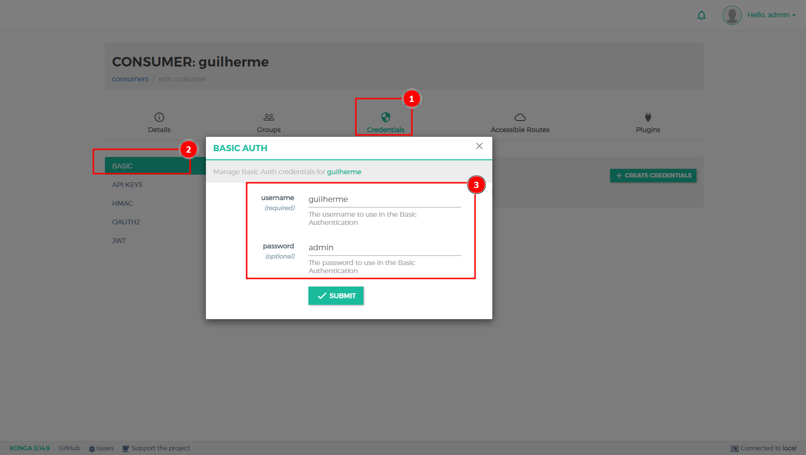

**Agora vamos configurar o Basic Auth:**

- Abra a aba de `Services`, clique no app `bets`, em `Plugins` e logo após em `+ADD PLUGIN`.
- Na tela que abrir, clique em **Authentication** e **Basic Auth**.
- Adicione o plugin conforme a **imagem abaixo**.
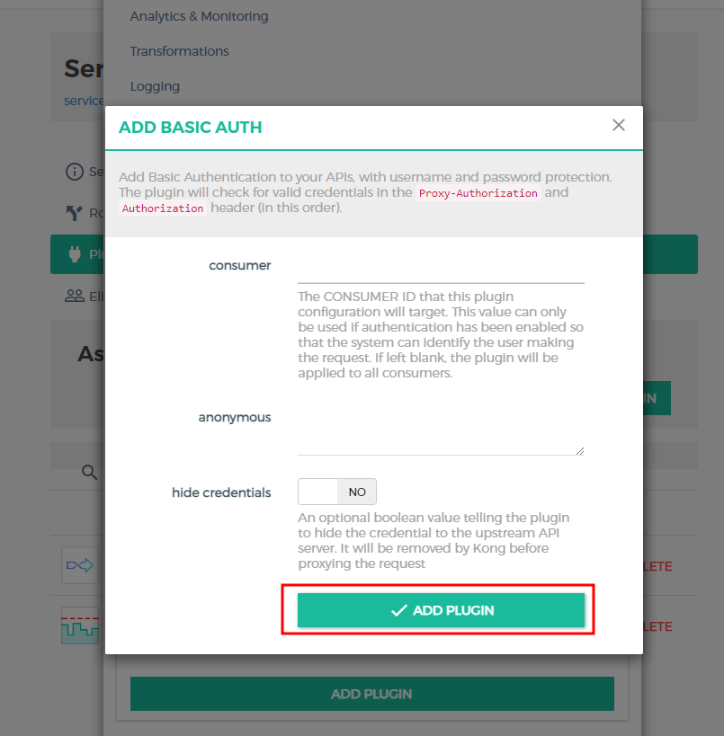

* Com isso, ao tentar fazer uma **request**, retornará o erro `401 Unauthorized`.

**Para resolver o problema:**
* Coloque seu `{username}:{senha}` criada no **Consumer** no site: https://www.base64encode.org/
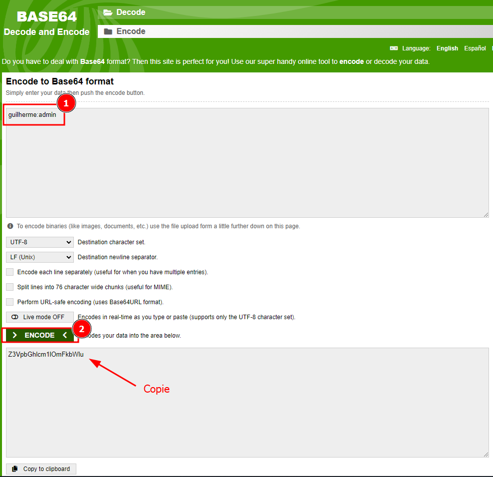
* Com seu **login criptografado**, cole no **Header** da request:
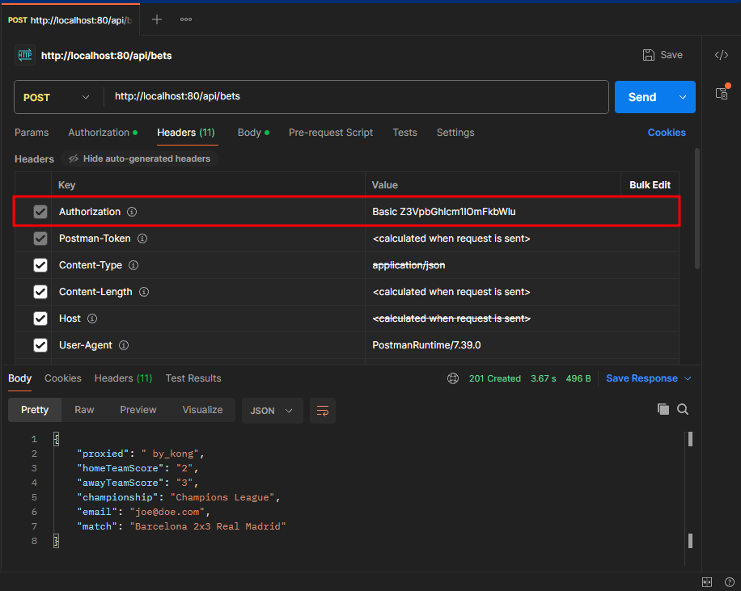

 

**Vamos criar uma API Key para nosso app de apostas:**
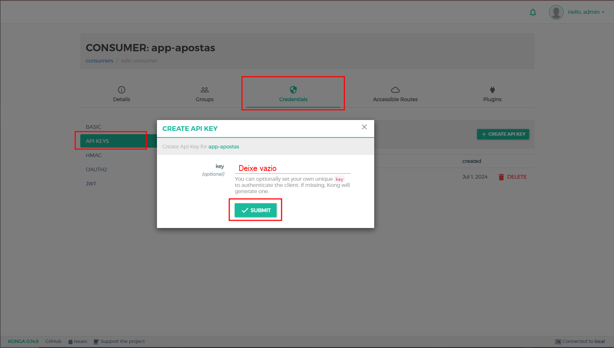

**Agora vamos configurar o Key Auth:**

- Remova o plugin de `Basic Auth`.
- Abra a aba de `Services`, clique no app `bets`, em `Plugins` e logo após em `+ADD PLUGIN`.
- Na tela que abrir, clique em **Authentication** e **Key Auth**.
- Adicione o plugin conforme a **imagem abaixo**.

**Para resolver o problema de Unauthorized:**
* Copie o token que foi gerado no **Consumer** `app-apostas` (imagem acima).
* Cole o token no **Header** da request:
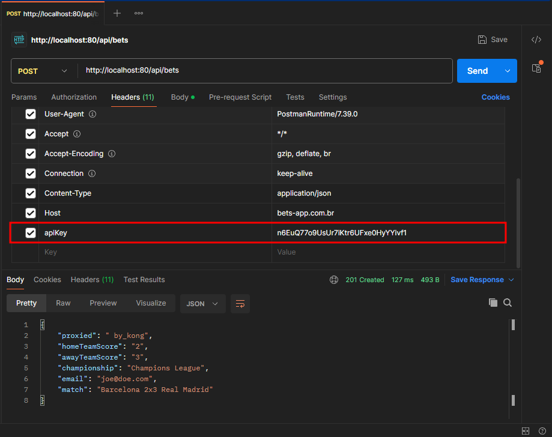

---

## Monitoramento e Observabilidade

O `monitoramento` geralmente envolve a coleta de **métricas e logs** para identificar possíveis problemas e tendências
de uso, enquanto a `observabilidade` vai além, permitindo uma compreensão mais profunda do sistema e a capacidade de
**investigar eventos específicos** de forma mais detalhada.

No kong_compose.yml temos os seguintes containers que são responsáveis por isso:

- **Grafana:** Exibe as métricas de forma visual;
- **Node_exporter:** Coleta as métricas do ecossistema;
- **Prometheus:** Coleta as métricas relacionadas ao desempenho, tráfego e uso das APIs gerenciadas pelo Kong.

**Vamos adicionar o plugin do Prometheus no Kong:**
- Abra a aba de `Plugins` e clique em `+ ADD GLOBAL PLUGINS`.
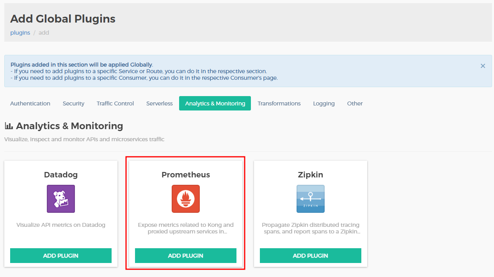
- Ao abrir a tela para configurar o Prometheus, apenas clique em **Adicionar**.

## Logging

É uma funcionalidade que permite registrar informações sobre as requisições HTTP que passam pelo API Gateway.

No kong_compose.yml temos os seguintes containers que são responsáveis por isso:

- **Fluent-bit:** Coleta as métricas de um lugar e encaminha para outro;
- **ElasticSearch:** Utilizado para indexar, pesquisar e analisar grandes volumes de dados de forma eficiente e em tempo real;
- **Kibana:** Ferramenta que mostra visualmente a coleta dos logs.

**Vamos adicionar o plugin de TCP LOG no Serviço de bets:**

- Abra a aba de `Services`, clique no app `bets`, em `Plugins` e logo após em `+ADD PLUGIN`.
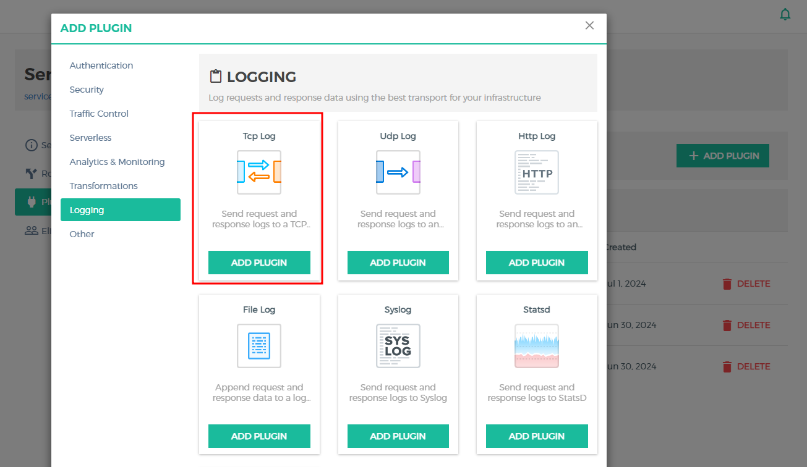
- Adicione as configurações abaixo:
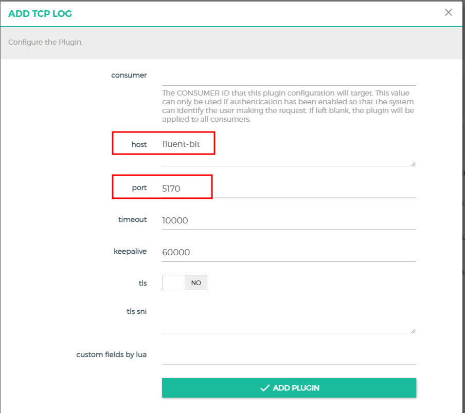